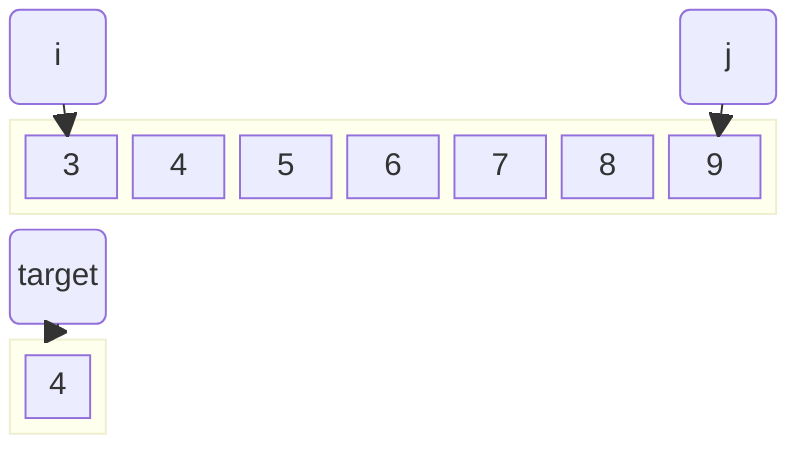
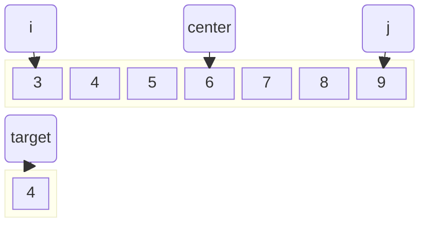
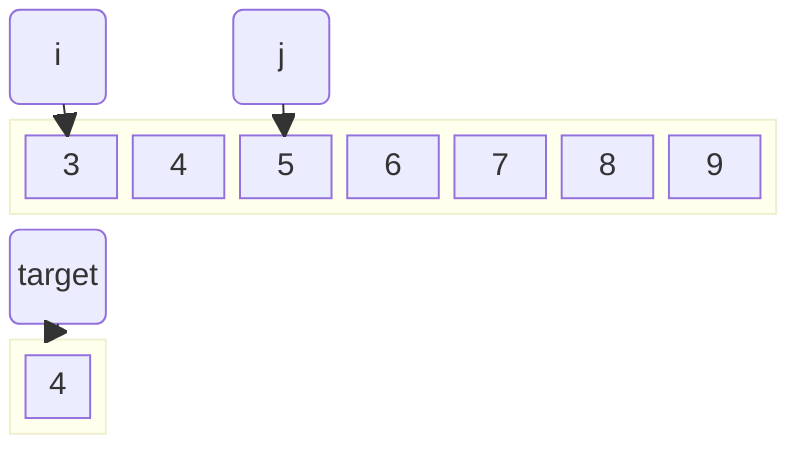
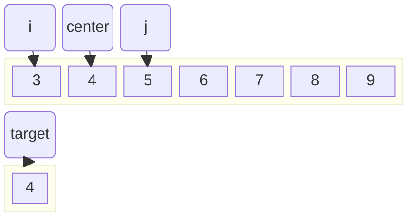

```mermaid
block-beta
  columns 7
  i("i") space:5 j("j")
  block:nums:7
    3 4 5 6 7 8 9
  end
  target("target") space:6
  block:params
    targetVal["4"]
  end

  i --> 3
  j --> 9
  target --> params
```

```mermaid
block-beta
  columns 7
  i("i") space:2 center("center") space:2 j("j")
  block:nums:7
    3 4 5 6 7 8 9
  end
  target("target") space:6
  block:params
    targetVal["4"]
  end

  i --> 3
  j --> 9
  center --> 6
  target --> params
```

```mermaid
block-beta
  columns 7
  i("i") space j("j") space:4
  block:nums:7
    3 4 5 6 7 8 9
  end
  target("target") space:6
  block:params
    targetVal["4"]
  end

  i --> 3
  j --> 5
  target --> params
```

```mermaid
block-beta
  columns 7
  i("i") center("center") j("j") space:4
  block:nums:7
    3 4 5 6 7 8 9
  end
  target("target") space:6
  block:params
    targetVal["4"]
  end

  i --> 3
  j --> 5
  center --> 4
  target --> params
```
