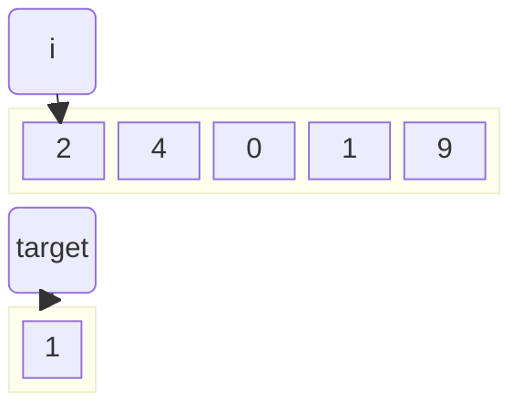
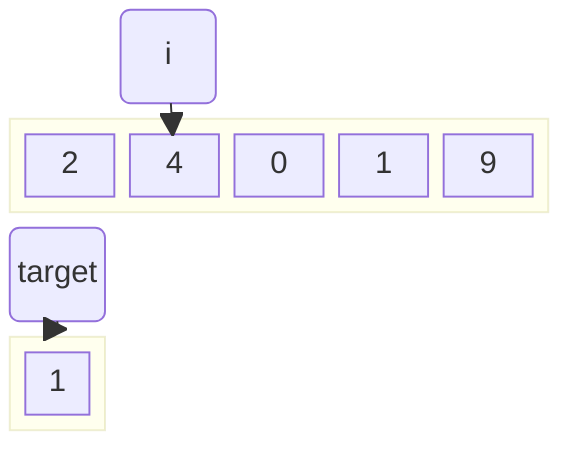
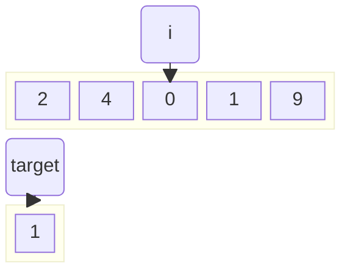
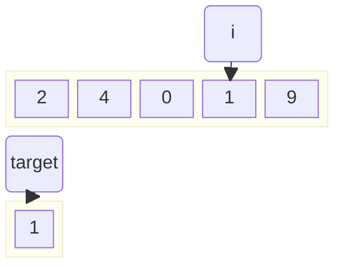

```mermaid
block-beta
  columns 5
  i("i") space:4
  block:nums:5
    2 4 0 1 9
  end
  target("target") space:4
  block:params
    targetVal["1"]
  end

  i --> 2
  target --> params
```

```mermaid
block-beta
  columns 5
  space i("i") space:3
  block:nums:5
    2 4 0 1 9
  end
  target("target") space:4
  block:params
    targetVal["1"]
  end

  i --> 4
  target --> params
```

```mermaid
block-beta
  columns 5
  space:2 i("i") space:2
  block:nums:5
    2 4 0 1 9
  end
  target("target") space:4
  block:params
    targetVal["1"]
  end

  i --> 0
  target --> params
```

```mermaid
block-beta
  columns 5
  space:3 i("i") space
  block:nums:5
    2 4 0 1 9
  end
  target("target") space:4
  block:params
    targetVal["1"]
  end

  i --> 1
  target --> params
```
