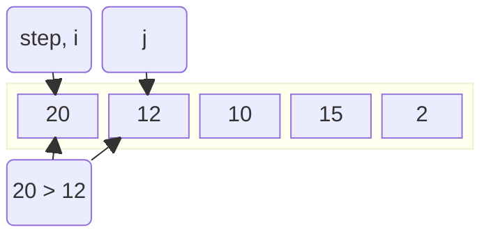
```mermaid
block-beta
  columns 5
  stepi("step, i") j("j") space:3
  block:nums:5
    20 12 10 15 2
  end
  compare("20 > 12")

  stepi --> 20
  j --> 12
  compare --> 20
  compare --> 12
```

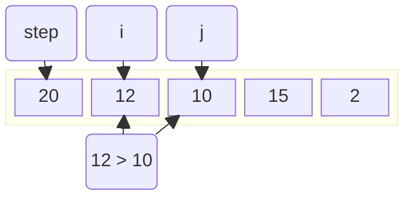
```mermaid
block-beta
  columns 5
  step("step") i("i") j("j") space:2
  block:nums:5
    20 12 10 15 2
  end
  space compare("12 > 10")

  step --> 20
  i --> 12
  j --> 10
  compare --> 12
  compare --> 10
```

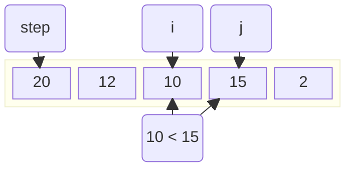
```mermaid
block-beta
  columns 5
  step("step") space i("i") j("j") space
  block:nums:5
    20 12 10 15 2
  end
  space:2 compare("10 < 15")

  step --> 20
  i --> 10
  j --> 15
  compare --> 10
  compare --> 15
```

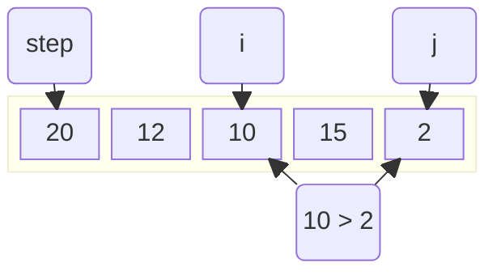
```mermaid
block-beta
  columns 5
  step("step") space i("i") space j("j")
  block:nums:5
    20 12 10 15 2
  end
  space:3 compare("10 > 2")

  step --> 20
  i --> 10
  j --> 2
  compare --> 10
  compare --> 2
```

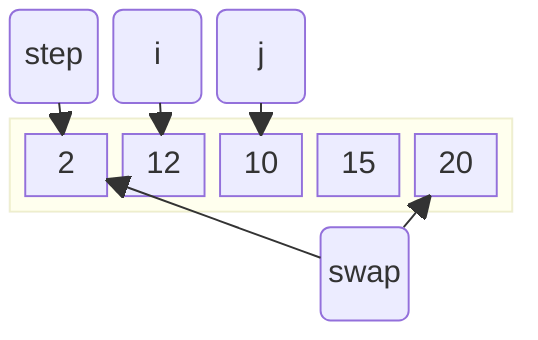
```mermaid
block-beta
  columns 5
  step("step") i("i") j("j") space:2
  block:nums:5
    2 12 10 15 20
  end
  space:3 compare("swap")

  step --> 2
  i --> 12
  j --> 10
  compare --> 20
  compare --> 2
```

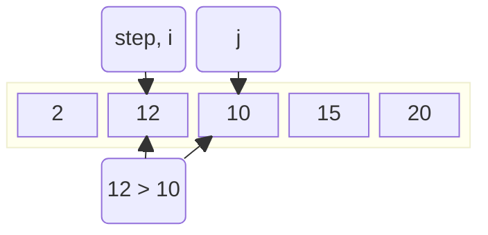
```mermaid
block-beta
  columns 5
  space stepi("step, i") j("j") space:2
  block:nums:5
    2 12 10 15 20
  end
  space compare("12 > 10")

  stepi --> 12
  j --> 10
  compare --> 12
  compare --> 10
```

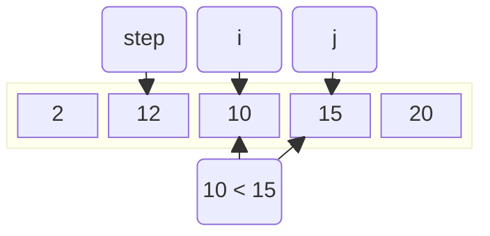
```mermaid
block-beta
  columns 5
  space step("step") i("i") j("j") space
  block:nums:5
    2 12 10 15 20
  end
  space:2 compare("10 < 15")

  step --> 12
  i --> 10
  j --> 15
  compare --> 10
  compare --> 15
```

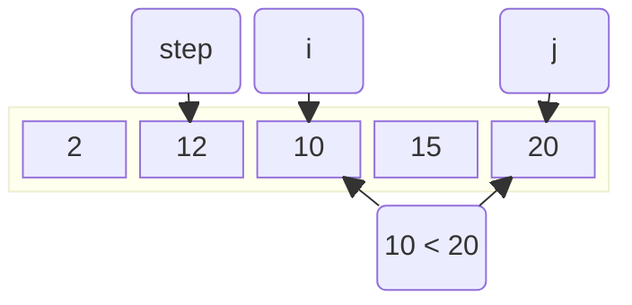
```mermaid
block-beta
  columns 5
  space step("step") i("i") space j("j")
  block:nums:5
    2 12 10 15 20
  end
  space:3 compare("10 < 20")

  step --> 12
  i --> 10
  j --> 20
  compare --> 10
  compare --> 20
```

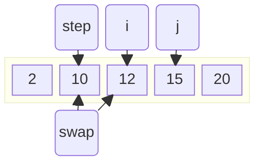
```mermaid
block-beta
  columns 5
  space step("step") i("i") j("j") space
  block:nums:5
    2 10 12 15 20
  end
  space compare("swap")

  step --> 10
  i --> 12
  j --> 15
  compare --> 10
  compare --> 12
```

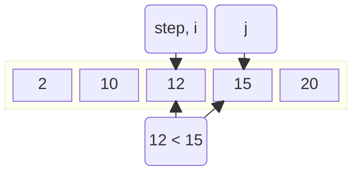
```mermaid
block-beta
  columns 5
  space:2 stepi("step, i") j("j") space
  block:nums:5
    2 10 12 15 20
  end
  space:2 compare("12 < 15")

  stepi --> 12
  j --> 15
  compare --> 12
  compare --> 15
```

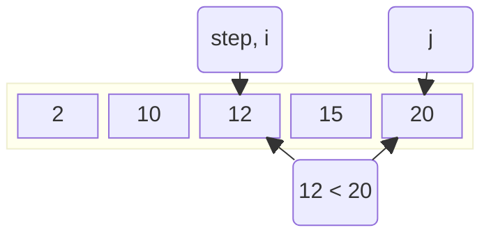
```mermaid
block-beta
  columns 5
  space:2 stepi("step, i") space j("j")
  block:nums:5
    2 10 12 15 20
  end
  space:3 compare("12 < 20")

  stepi --> 12
  j --> 20
  compare --> 12
  compare --> 20
```

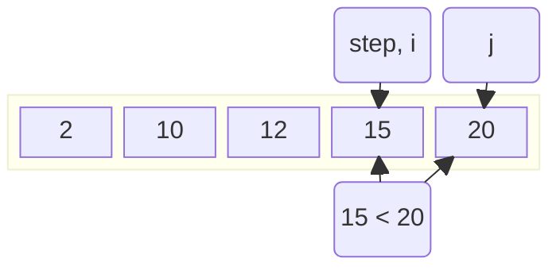
```mermaid
block-beta
  columns 5
  space:3 stepi("step, i") j("j")
  block:nums:5
    2 10 12 15 20
  end
  space:3 compare("15 < 20")

  stepi --> 15
  j --> 20
  compare --> 15
  compare --> 20
```
