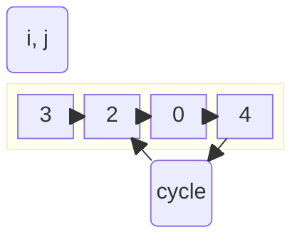
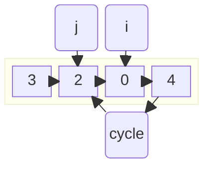
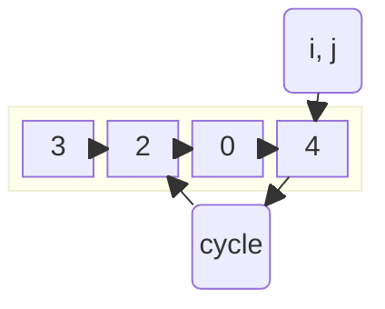

```mermaid
block-beta
  columns 4
  ij("i, j") space:3
  block:nums:4
    3 2 0 4
  end
  space:2 cycle("cycle")

  3 --> 2
  2 --> 0
  0 --> 4
  4 --> cycle
  cycle --> 2
```

```mermaid
block-beta
  columns 4
  space i("i") j("j") space
  block:nums:4
    3 2 0 4
  end
  space:2 cycle("cycle")

  3 --> 2
  2 --> 0
  0 --> 4
  4 --> cycle
  cycle --> 2

  i --> 2
  j --> 0
```

```mermaid
block-beta
  columns 4
  space j("j") i("i") space
  block:nums:4
    3 2 0 4
  end
  space:2 cycle("cycle")

  3 --> 2
  2 --> 0
  0 --> 4
  4 --> cycle
  cycle --> 2

  i --> 0
  j --> 2
```

```mermaid
block-beta
  columns 4
  space:3 ij("i, j")
  block:nums:4
    3 2 0 4
  end
  space:2 cycle("cycle")

  3 --> 2
  2 --> 0
  0 --> 4
  4 --> cycle
  cycle --> 2

  ij --> 4
```
