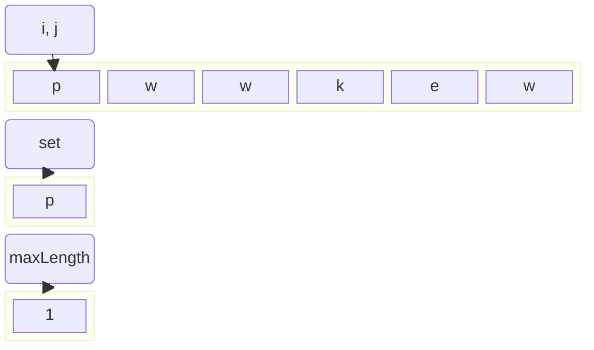
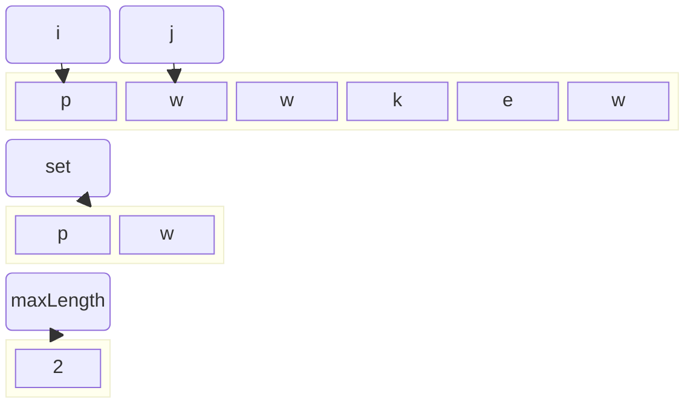
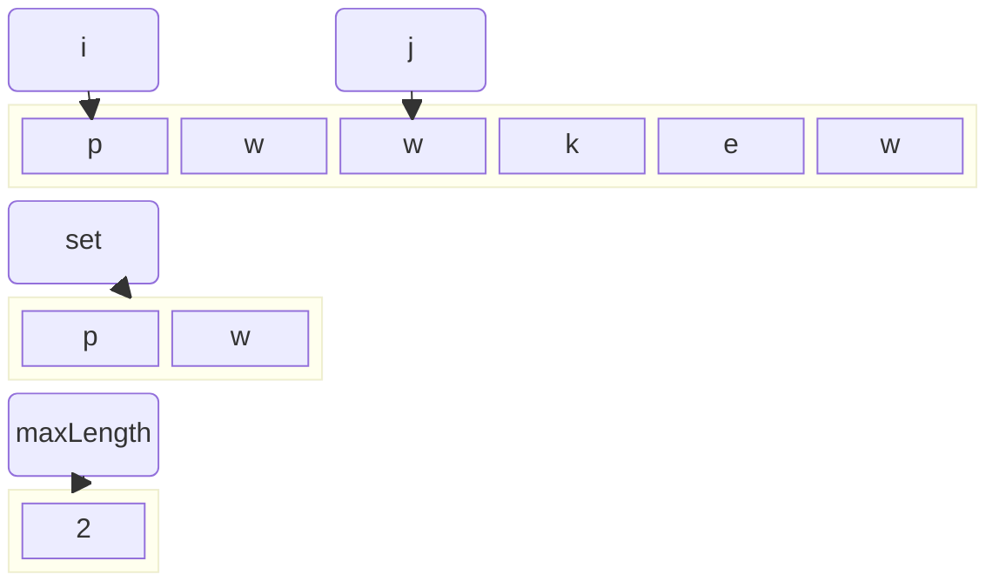
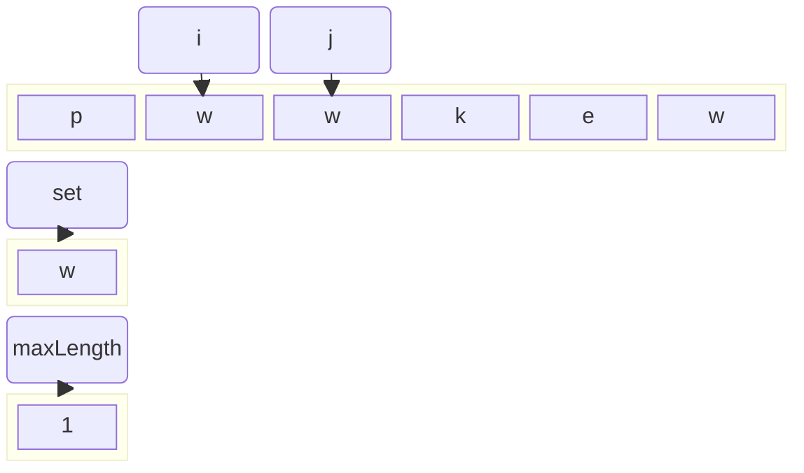
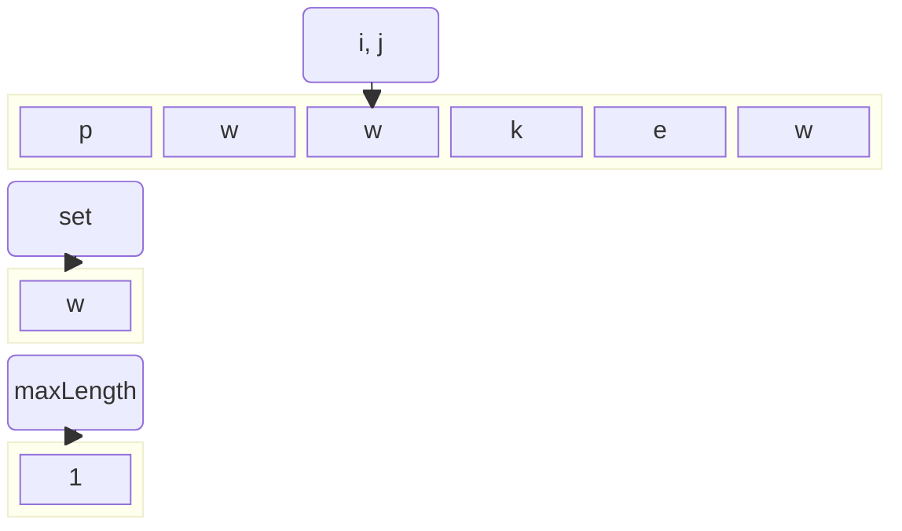
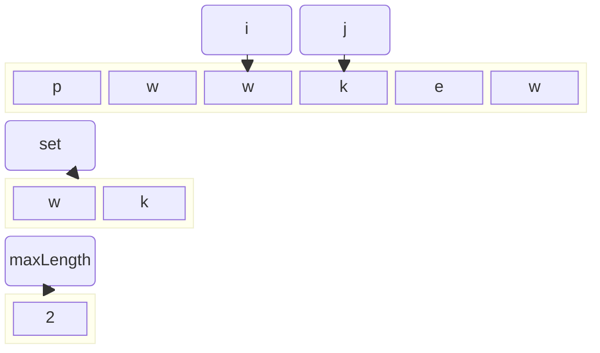
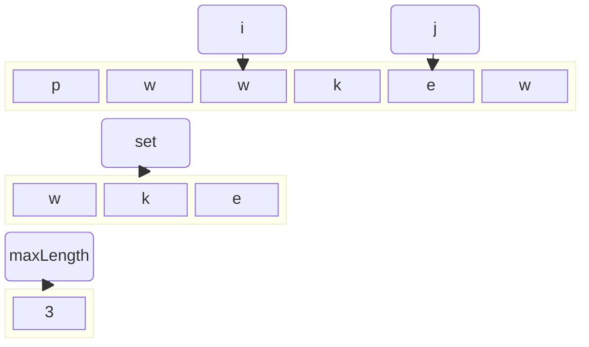

```mermaid
block-beta
  columns 6
  ij("i, j") space:5
  block:s:6
    a1["p"] b1["w"] c1["w"] d1["k"] e1["e"] f1["w"]
  end
  set("set") space:5
  block:s2
    a2["p"]
  end
  space:5 maxLength("maxLength") space:5
  block:params
    maxLengthVal["1"]
  end

  ij --> a1
  set --> s2
  maxLength --> params
```

```mermaid
block-beta
  columns 6
  i("i") j("j") space:4
  block:s:6
    a1["p"] b1["w"] c1["w"] d1["k"] e1["e"] f1["w"]
  end
  set("set") space:5
  block:s2:2
    a2["p"] b2["w"]
  end
  space:4 maxLength("maxLength") space:5
  block:params
    maxLengthVal["2"]
  end

  i --> a1
  j --> b1
  set --> s2
  maxLength --> params
```

```mermaid
block-beta
  columns 6
  i("i") space j("j") space:3
  block:s:6
    a1["p"] b1["w"] c1["w"] d1["k"] e1["e"] f1["w"]
  end
  set("set") space:5
  block:s2:2
    a2["p"] b2["w"]
  end
  space:4 maxLength("maxLength") space:5
  block:params
    maxLengthVal["2"]
  end

  i --> a1
  j --> c1
  set --> s2
  maxLength --> params
```

```mermaid
block-beta
  columns 6
  space i("i") j("j") space:3
  block:s:6
    a1["p"] b1["w"] c1["w"] d1["k"] e1["e"] f1["w"]
  end
  set("set") space:5
  block:s2
    a2["w"]
  end
  space:5 maxLength("maxLength") space:5
  block:params
    maxLengthVal["1"]
  end

  i --> b1
  j --> c1
  set --> s2
  maxLength --> params
```

```mermaid
block-beta
  columns 6
  space:2 ij("i, j") space:3
  block:s:6
    a1["p"] b1["w"] c1["w"] d1["k"] e1["e"] f1["w"]
  end
  set("set") space:5
  block:s2
    a2["w"]
  end
  space:5 maxLength("maxLength") space:5
  block:params
    maxLengthVal["1"]
  end

  ij --> c1
  set --> s2
  maxLength --> params
```

```mermaid
block-beta
  columns 6
  space:2 i("i") j("j") space:2
  block:s:6
    a1["p"] b1["w"] c1["w"] d1["k"] e1["e"] f1["w"]
  end
  set("set") space:5
  block:s2:2
    a2["w"] b2["k"]
  end
  space:4 maxLength("maxLength") space:5
  block:params
    maxLengthVal["2"]
  end

  i --> c1
  j --> d1
  set --> s2
  maxLength --> params
```

```mermaid
block-beta
  columns 6
  space:2 i("i") space j("j") space
  block:s:6
    a1["p"] b1["w"] c1["w"] d1["k"] e1["e"] f1["w"]
  end
  space set("set") space:4
  block:s2:3
    a2["w"] b2["k"] c2["e"]
  end
  space:3 maxLength("maxLength") space:5
  block:params
    maxLengthVal["3"]
  end

  i --> c1
  j --> e1
  set --> s2
  maxLength --> params
```
