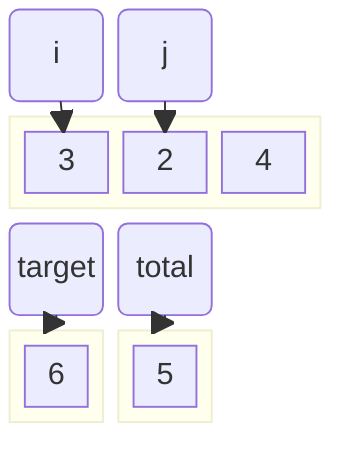
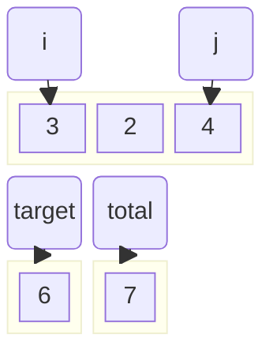
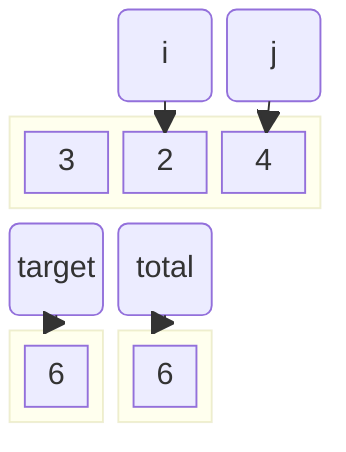

```mermaid
block-beta
  columns 3
  i("i") j("j") space
  block:nums:3
    3 2 4
  end
  target("target") total("total") space
  block:params
    targetVal["6"]
  end
  block:return
    totalValue["5"]
  end

  i --> 3
  j --> 2
  target --> params
  total --> return
```

```mermaid
block-beta
  columns 3
  i("i") space j("j")
  block:nums:3
    3 2 4
  end
  target("target") total("total") space
  block:params
    targetVal["6"]
  end
  block:return
    totalValue["7"]
  end

  i --> 3
  j --> 4
  target --> params
  total --> return
```

```mermaid
block-beta
  columns 3
  space i("i") j("j")
  block:nums:3
    3 2 4
  end
  target("target") total("total") space
  block:params
    targetVal["6"]
  end
  block:return
    totalValue["6"]
  end

  i --> 2
  j --> 4
  target --> params
  total --> return
```
