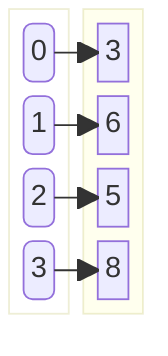

!!! quote inline end
    &ldquo;Should array indices start at 0 or 1? My compromise of 0.5 was
    rejected without, I thought, proper consideration.&rdquo;
    &mdash; *Stan Kelly-Bootle*

=== "Java"
    Operation | ArrayList [:material-information-variant:][array] | LinkedList [:material-information-variant:][linked-list] | CopyOnWriteArrayList [:material-information-variant:][array]
    --- | :---: | :---: | :---:
    Add | $\color{white} \fcolorbox{limegreen}{forestgreen} {O(1)}$ | $\color{white} \fcolorbox{limegreen}{forestgreen} {O(1)}$ | $\color{black} \fcolorbox{gold}{yellow} {O(n)}$
    Remove | $\color{black} \fcolorbox{gold}{yellow} {O(n)}$ | $\color{white} \fcolorbox{limegreen}{forestgreen} {O(1)}$ | $\color{black} \fcolorbox{gold}{yellow} {O(n)}$
    Get | $\color{white} \fcolorbox{limegreen}{forestgreen} {O(1)}$ | $\color{black} \fcolorbox{gold}{yellow} {O(n)}$ | $\color{white} \fcolorbox{limegreen}{forestgreen} {O(1)}$
    Contains | $\color{black} \fcolorbox{gold}{yellow} {O(n)}$ | $\color{black} \fcolorbox{gold}{yellow} {O(n)}$ | $\color{black} \fcolorbox{gold}{yellow} {O(n)}$
    Next | $\color{white} \fcolorbox{limegreen}{forestgreen} {O(1)}$ | $\color{white} \fcolorbox{limegreen}{forestgreen} {O(1)}$ | $\color{white} \fcolorbox{limegreen}{forestgreen} {O(1)}$
=== "Python"
    Operation | list [:material-information-variant:][array]
    --- | :---:
    Copy | $\color{black} \fcolorbox{gold}{yellow} {Θ(n)}$ &rarr; $\color{black} \fcolorbox{gold}{yellow} {O(n)}$
    Append | $\color{white} \fcolorbox{limegreen}{forestgreen} {Θ(1)}$ &rarr; $\color{white} \fcolorbox{limegreen}{forestgreen} {O(1)}$
    Pop last | $\color{white} \fcolorbox{limegreen}{forestgreen} {Θ(1)}$ &rarr; $\color{white} \fcolorbox{limegreen}{forestgreen} {O(1)}$
    Pop intermediate | $\color{black} \fcolorbox{gold}{yellow} {Θ(n)}$ &rarr; $\color{black} \fcolorbox{gold}{yellow} {O(n)}$
    Insert | $\color{black} \fcolorbox{gold}{yellow} {Θ(n)}$ &rarr; $\color{black} \fcolorbox{gold}{yellow} {O(n)}$
    Get item | $\color{white} \fcolorbox{limegreen}{forestgreen} {Θ(1)}$ &rarr; $\color{white} \fcolorbox{limegreen}{forestgreen} {O(1)}$
    Set item | $\color{white} \fcolorbox{limegreen}{forestgreen} {Θ(1)}$ &rarr; $\color{white} \fcolorbox{limegreen}{forestgreen} {O(1)}$
    Delete item | $\color{black} \fcolorbox{gold}{yellow} {Θ(n)}$ &rarr; $\color{black} \fcolorbox{gold}{yellow} {O(n)}$
    Iteration | $\color{black} \fcolorbox{gold}{yellow} {Θ(n)}$ &rarr; $\color{black} \fcolorbox{gold}{yellow} {O(n)}$
    Get slice | $\color{black} \fcolorbox{yellowgreen}{greenyellow} {Θ(k)}$ &rarr; $\color{black} \fcolorbox{yellowgreen}{greenyellow} {O(k)}$
    Del slice | $\color{black} \fcolorbox{gold}{yellow} {Θ(n)}$ &rarr; $\color{black} \fcolorbox{gold}{yellow} {O(n)}$
    Set slice | $\color{black} \fcolorbox{yellowgreen}{greenyellow} {Θ(k + n)}$ &rarr; $\color{black} \fcolorbox{yellowgreen}{greenyellow} {O(k + n)}$
    Extend | $\color{black} \fcolorbox{yellowgreen}{greenyellow} {Θ(k)}$ &rarr; $\color{black} \fcolorbox{yellowgreen}{greenyellow} {O(k)}$
    Sort | $\color{black} \fcolorbox{yellowgreen}{greenyellow} {Θ(log(n))}$ &rarr; $\color{black} \fcolorbox{yellowgreen}{greenyellow} {O(log(n))}$
    Multiply | $\color{black} \fcolorbox{yellowgreen}{greenyellow} {Θ(n . k)}$ &rarr; $\color{black} \fcolorbox{yellowgreen}{greenyellow} {O(n . k)}$
    `x in s` | $\color{black} \fcolorbox{gold}{yellow} {Θ(n)}$
    `mins(s)`, `max(s)` | $\color{black} \fcolorbox{gold}{yellow} {Θ(n)}$
    Get length | $\color{white} \fcolorbox{limegreen}{forestgreen} {Θ(1)}$ &rarr; $\color{white} \fcolorbox{limegreen}{forestgreen} {O(1)}$

Lists are a collection of elements that can be accessed by their index.

<div class="grid" markdown>
=== "Groovy"
    ```groovy
    var empty = Collections.emptyList()
    var singleton = Collections.singletonList(1)
    var list = [1, 2, 3]
    var unmodifiableList = Collections.unmodifiableList(arrayList)
    ```
=== "Java"
    ```java
    List<Integer> empty = Collections.emptyList();
    List<Integer> singleton = Collections.singletonList(1);
    List<Integer> list = new ArrayList<>(Arrays.asList(1, 2, 3));
    List<Integer> unmodifiableList = Collections.unmodifiableList(arrayList);
    ```
=== "JavaScript"
    ```javascript
    const list = [1, 2, 3];
    const unmodifiableList = Object.freeze(list);
    ```
=== "Kotlin"
    ```kotlin
    val empty = emptyList<Int>()
    val singleton = listOf(1)
    val list = mutableListOf(1, 2, 3)
    val unmodifiableList = listOf(1, 2, 3)
    ```
=== "Python"
    ```python
    l = [1, 2, 3]
    unmodifiable_list = tuple(l)
    ```
=== "TypeScript"
    ```typescript
    const list: number[] = [1, 2, 3];
    const unmodifiableList: readonly number[] = Object.freeze(list);
    ```


</div>

### Which one to use?

<div class="grid cards" markdown>
- :material-fast-forward:{ .lg .middle } **ArrayList** is the fastest to iterate.
- :material-pencil:{ .lg .middle } Use **LinkedList** when elements are frequently modified.
</div>

[array]: https://en.wikipedia.org/wiki/Array_(data_structure) "Wikipedia: Array (data structure)"
[linked-list]: https://en.wikipedia.org/wiki/Linked_list "Wikipedia: Linked list"
