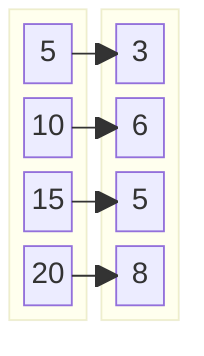

!!! quote inline end
    &ldquo;**Bad programmers** worry about the code. **Good programmers** worry
    about data structures and their relationships.&rdquo;
    &mdash; *Linus Torvalds*

=== "Java"
    Operation | HashMap [:material-information-variant:][hash-table] | LinkedHashMap [:material-information-variant:][hash-table] | IdentityHashMap [:material-information-variant:][array] | WeakHashMap [:material-information-variant:][hash-table] | EnumMap [:material-information-variant:][array] | TreeMap [:material-information-variant:][red-black-tree] | ConcurrentHashMap [:material-information-variant:][hash-table] | ConcurrentSkipListMap [:material-information-variant:][skip-list]
    --- | :---: | :---: | :---: | :---: | :---: | :---: | :---: | :---:
    Get | $\color{white} \fcolorbox{limegreen}{forestgreen} {O(1)}$ | $\color{white} \fcolorbox{limegreen}{forestgreen} {O(1)}$ | $\color{white} \fcolorbox{limegreen}{forestgreen} {O(1)}$ | $\color{white} \fcolorbox{limegreen}{forestgreen} {O(1)}$ | $\color{white} \fcolorbox{limegreen}{forestgreen} {O(1)}$ | $\color{black} \fcolorbox{yellowgreen}{greenyellow} {O(log(n))}$ | $\color{white} \fcolorbox{limegreen}{forestgreen} {O(1)}$ | $\color{black} \fcolorbox{yellowgreen}{greenyellow} {O(log(n))}$
    Contains | $\color{white} \fcolorbox{limegreen}{forestgreen} {O(1)}$ | $\color{white} \fcolorbox{limegreen}{forestgreen} {O(1)}$ | $\color{white} \fcolorbox{limegreen}{forestgreen} {O(1)}$ | $\color{white} \fcolorbox{limegreen}{forestgreen} {O(1)}$ | $\color{white} \fcolorbox{limegreen}{forestgreen} {O(1)}$ | $\color{black} \fcolorbox{yellowgreen}{greenyellow} {O(log(n))}$ | $\color{white} \fcolorbox{limegreen}{forestgreen} {O(1)}$ | $\color{black} \fcolorbox{yellowgreen}{greenyellow} {O(log(n))}$
    Next | $\color{black} \fcolorbox{yellowgreen}{greenyellow} {O(h / n)}$ | $\color{white} \fcolorbox{limegreen}{forestgreen} {O(1)}$ | $\color{black} \fcolorbox{yellowgreen}{greenyellow} {O(h / n)}$ | $\color{black} \fcolorbox{yellowgreen}{greenyellow} {O(h / n)}$ | $\color{white} \fcolorbox{limegreen}{forestgreen} {O(1)}$ | $\color{black} \fcolorbox{yellowgreen}{greenyellow} {O(log(n))}$ | $\color{black} \fcolorbox{yellowgreen}{greenyellow} {O(h / n)}$ | $\color{white} \fcolorbox{limegreen}{forestgreen} {O(1)}$
=== "Python"
    Operation | dict [:material-information-variant:][hash-table]
    --- | :---:
    `k in d` | $\color{white} \fcolorbox{limegreen}{forestgreen} {Θ(1)}$ &rarr; $\color{black} \fcolorbox{gold}{yellow} {O(n)}$
    Copy | $\color{black} \fcolorbox{gold}{yellow} {O(n)}$
    Get item | $\color{white} \fcolorbox{limegreen}{forestgreen} {Θ(1)}$ &rarr; $\color{black} \fcolorbox{gold}{yellow} {O(n)}$
    Set item | $\color{white} \fcolorbox{limegreen}{forestgreen} {Θ(1)}$ &rarr; $\color{black} \fcolorbox{gold}{yellow} {O(n)}$
    Delete item | $\color{white} \fcolorbox{limegreen}{forestgreen} {Θ(1)}$ &rarr; $\color{black} \fcolorbox{gold}{yellow} {O(n)}$
    Iteration | $\color{black} \fcolorbox{gold}{yellow} {O(n)}$

Maps are a collection of key-value pairs.

<div class="grid" markdown>
=== "Groovy"
    ```groovy
    var map = [
        5: 1,
        10: 2,
        20: 3,
    ]

    var unmodifiableMap = Collections.unmodifiableMap(map)
    ```
=== "Java"
    ```java
    Map<Integer, Integer> map = new HashMap<>();
    map.put(1, 2);
    map.put(2, 3);
    map.put(3, 4);

    Map<Integer, Integer> unmodifiableMap = Collections.unmodifiableMap(map);
    ```
=== "JavaScript"
    ```javascript
    const map =
        new Map([
            [5, 1],
            [10, 2],
            [20, 3],
        ]);
    ```
=== "Kotlin"
    ```kotlin
    val map =
        mutableMapOf(
            5 to 1,
            10 to 2,
            20 to 3
        )

    val unmodifiableMap = map.toMap()
    ```
=== "Python"
    ```python
    map = {
        5: 1,
        10: 2,
        20: 3,
    }
    ```
=== "TypeScript"
    ```typescript
    const map =
        new Map<number, number>([
            [5, 1],
            [10, 2],
            [20, 3],
        ]);
    ```


</div>

### Which one to use?

<div class="grid cards" markdown>
- :material-fast-forward:{ .lg .middle } **HashMap** is the fastest to iterate.
- :material-sort-numeric-ascending:{ .lg .middle } Use **LinkedHashMap** when the insertion order matters.
- :material-sort-alphabetical-ascending:{ .lg .middle } Use **TreeMap** when the natural order matters.
- :material-delete-outline:{ .lg .middle } Use **WeakHashMap** for in-memory caching.
- :material-server-network-outline:{ .lg .middle } Use **ConcurrentHashMap** for thread-safe operations.
</div>

[array]: https://en.wikipedia.org/wiki/Array_(data_structure) "Wikipedia: Array (data structure)"
[hash-table]: https://en.wikipedia.org/wiki/hash-table "Wikipedia: Hash table"
[red-black-tree]: https://en.wikipedia.org/wiki/Red-black_tree "Wikipedia: Red-black tree"
[skip-list]: https://en.wikipedia.org/wiki/skip-list "Wikipedia: Skip list"
