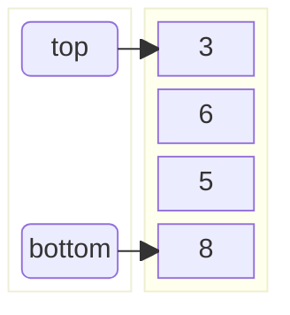

!!! quote inline end
    &ldquo;It is better to have 100 functions operate on one data structure than
    to have 10 functions operate on 10 data structures.&rdquo;
    &mdash; *Alan Perlis*

=== "Java"
    Operation | PriorityQueue [:material-information-variant:][priority-queue] | LinkedList [:material-information-variant:][linked-list] | ArrayDequeue [:material-information-variant:][array] | ConcurrentLinkedQueue [:material-information-variant:][linked-list] | ArrayBlockingQueue [:material-information-variant:][array] | PriorityBlockingQueue [:material-information-variant:][priority-queue] | SynchronousQueue | DelayQueue [:material-information-variant:][priority-queue] | LinkedBlockingQueue [:material-information-variant:][linked-list]
    --- | :---: | :---: | :---: | :---: | :---: | :---: | :---: | :---: | :---:
    Offer | $\color{black} \fcolorbox{yellowgreen}{greenyellow} {O(log(n))}$ | $\color{white} \fcolorbox{limegreen}{forestgreen} {O(1)}$ | $\color{white} \fcolorbox{limegreen}{forestgreen} {O(1)}$ | $\color{white} \fcolorbox{limegreen}{forestgreen} {O(1)}$ | $\color{white} \fcolorbox{limegreen}{forestgreen} {O(1)}$ | $\color{black} \fcolorbox{yellowgreen}{greenyellow} {O(log(n))}$ | $\color{white} \fcolorbox{limegreen}{forestgreen} {O(1)}$ | $\color{black} \fcolorbox{yellowgreen}{greenyellow} {O(log(n))}$ | $\color{white} \fcolorbox{limegreen}{forestgreen} {O(1)}$
    Peek | $\color{white} \fcolorbox{limegreen}{forestgreen} {O(1)}$ | $\color{white} \fcolorbox{limegreen}{forestgreen} {O(1)}$ | $\color{white} \fcolorbox{limegreen}{forestgreen} {O(1)}$ | $\color{white} \fcolorbox{limegreen}{forestgreen} {O(1)}$ | $\color{white} \fcolorbox{limegreen}{forestgreen} {O(1)}$ | $\color{white} \fcolorbox{limegreen}{forestgreen} {O(1)}$ | $\color{white} \fcolorbox{limegreen}{forestgreen} {O(1)}$ | $\color{white} \fcolorbox{limegreen}{forestgreen} {O(1)}$ | $\color{white} \fcolorbox{limegreen}{forestgreen} {O(1)}$
    Poll | $\color{black} \fcolorbox{yellowgreen}{greenyellow} {O(log(n))}$ | $\color{white} \fcolorbox{limegreen}{forestgreen} {O(1)}$ | $\color{white} \fcolorbox{limegreen}{forestgreen} {O(1)}$ | $\color{white} \fcolorbox{limegreen}{forestgreen} {O(1)}$ | $\color{white} \fcolorbox{limegreen}{forestgreen} {O(1)}$ | $\color{black} \fcolorbox{yellowgreen}{greenyellow} {O(log(n))}$ | $\color{white} \fcolorbox{limegreen}{forestgreen} {O(1)}$ | $\color{black} \fcolorbox{yellowgreen}{greenyellow} {O(log(n))}$ | $\color{white} \fcolorbox{limegreen}{forestgreen} {O(1)}$
    Remove | $\color{black} \fcolorbox{gold}{yellow} {O(n)}$ | $\color{white} \fcolorbox{limegreen}{forestgreen} {O(1)}$ | $\color{black} \fcolorbox{gold}{yellow} {O(n)}$ | $\color{black} \fcolorbox{gold}{yellow} {O(n)}$ | $\color{black} \fcolorbox{gold}{yellow} {O(n)}$ | $\color{black} \fcolorbox{gold}{yellow} {O(n)}$ | $\color{black} \fcolorbox{gold}{yellow} {O(n)}$ | $\color{black} \fcolorbox{gold}{yellow} {O(n)}$ | $\color{black} \fcolorbox{gold}{yellow} {O(n)}$
    Size | $\color{white} \fcolorbox{limegreen}{forestgreen} {O(1)}$ | $\color{white} \fcolorbox{limegreen}{forestgreen} {O(1)}$ | $\color{white} \fcolorbox{limegreen}{forestgreen} {O(1)}$ | $\color{black} \fcolorbox{gold}{yellow} {O(n)}$ | $\color{white} \fcolorbox{limegreen}{forestgreen} {O(1)}$ | $\color{white} \fcolorbox{limegreen}{forestgreen} {O(1)}$ | $\color{white} \fcolorbox{limegreen}{forestgreen} {O(1)}$ | $\color{white} \fcolorbox{limegreen}{forestgreen} {O(1)}$ | $\color{white} \fcolorbox{limegreen}{forestgreen} {O(1)}$
=== "Python"
    Operation | collections.deque [:material-information-variant:][linked-list]
    --- | :---:
    Copy | $\color{black} \fcolorbox{gold}{yellow} {Θ(n)}$ &rarr; $\color{black} \fcolorbox{gold}{yellow} {O(n)}$
    Append | $\color{white} \fcolorbox{limegreen}{forestgreen} {Θ(1)}$ &rarr; $\color{white} \fcolorbox{limegreen}{forestgreen} {O(1)}$
    Append left |$\color{white} \fcolorbox{limegreen}{forestgreen} {Θ(1)}$ &rarr; $\color{white} \fcolorbox{limegreen}{forestgreen} {O(1)}$
    Pop | $\color{white} \fcolorbox{limegreen}{forestgreen} {Θ(1)}$ &rarr; $\color{white} \fcolorbox{limegreen}{forestgreen} {O(1)}$
    Pop left | $\color{white} \fcolorbox{limegreen}{forestgreen} {Θ(1)}$ &rarr; $\color{white} \fcolorbox{limegreen}{forestgreen} {O(1)}$
    Extend | $\color{black} \fcolorbox{yellowgreen}{greenyellow} {Θ(k)}$ &rarr; $\color{black} \fcolorbox{yellowgreen}{greenyellow} {O(k)}$
    Extend left | $\color{black} \fcolorbox{yellowgreen}{greenyellow} {Θ(k)}$ &rarr; $\color{black} \fcolorbox{yellowgreen}{greenyellow} {O(k)}$
    Rotate | $\color{black} \fcolorbox{yellowgreen}{greenyellow} {Θ(k)}$ &rarr; $\color{black} \fcolorbox{yellowgreen}{greenyellow} {O(k)}$
    Remove | $\color{black} \fcolorbox{gold}{yellow} {Θ(n)}$ &rarr; $\color{black} \fcolorbox{gold}{yellow} {O(n)}$
    Get length | $\color{white} \fcolorbox{limegreen}{forestgreen} {Θ(1)}$ &rarr; $\color{white} \fcolorbox{limegreen}{forestgreen} {O(1)}$

Queues are a type of data structure that follow the **FIFO** (First In First
Out) principle.

<div class="grid" markdown>
=== "Groovy"
    ```groovy
    Queue<Integer> queue = []
    queue << 1
    queue << 2
    queue << 3
    ```
=== "Java"
    ```java
    Queue<Integer> queue = new LinkedList<>();
    queue.add(1);
    queue.add(2);
    queue.add(3);
    ```
=== "Kotlin"
    ```kotlin
    val queue = LinkedList<Int>()
    queue += 1
    queue += 2
    queue += 3
    ```
=== "Python"
    ```python
    from collections import deque

    queue = deque(1, 2, 3)
    ```


</div>

### Which one to use?

<div class="grid cards" markdown>
- :material-sort-numeric-ascending:{ .lg .middle } Use **LinkedList** when the insertion order matters.
- :material-sort-alphabetical-ascending:{ .lg .middle } Use **PriorityQueue** when the natural order matters.
</div>

[array]: https://en.wikipedia.org/wiki/Array_(data_structure) "Wikipedia: Array (data structure)"
[linked-list]: https://en.wikipedia.org/wiki/linked-list "Wikipedia: Linked list"
[priority-queue]: https://en.wikipedia.org/wiki/priority-queue "Wikipedia: Priority queue"
