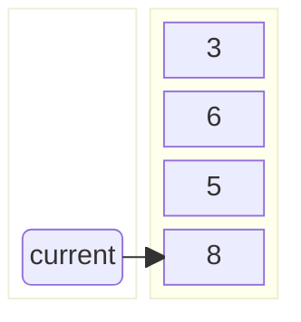

!!! quote inline end
    &ldquo;Smart data structures and dumb code works a lot better than the other
    way around.&rdquo;
    &mdash; *Eric S. Raymond*

=== "Java"
    Operation | HashSet [:material-information-variant:][hash-table] | LinkedHashSet [:material-information-variant:][hash-table] | EnumSet [:material-information-variant:][bit-array] | TreeSet [:material-information-variant:][red-black-tree] | CopyOnWriteArraySet [:material-information-variant:][array] | ConcurrentSkipListSet [:material-information-variant:][skip-list]
    --- | :---: | :---: | :---: | :---: | :---: | :---:
    Add | $\color{white} \fcolorbox{limegreen}{forestgreen} {O(1)}$ | $\color{white} \fcolorbox{limegreen}{forestgreen} {O(1)}$ | $\color{white} \fcolorbox{limegreen}{forestgreen} {O(1)}$ | $\color{black} \fcolorbox{yellowgreen}{greenyellow} {O(log(n))}$ | $\color{black} \fcolorbox{gold}{yellow} {O(n)}$ | $\color{black} \fcolorbox{yellowgreen}{greenyellow} {O(log(n))}$
    Remove | $\color{white} \fcolorbox{limegreen}{forestgreen} {O(1)}$ | $\color{white} \fcolorbox{limegreen}{forestgreen} {O(1)}$ | $\color{white} \fcolorbox{limegreen}{forestgreen} {O(1)}$ | $\color{black} \fcolorbox{yellowgreen}{greenyellow} {O(log(n))}$ | $\color{black} \fcolorbox{gold}{yellow} {O(n)}$ | $\color{black} \fcolorbox{yellowgreen}{greenyellow} {O(log(n))}$
    Contains | $\color{white} \fcolorbox{limegreen}{forestgreen} {O(1)}$ | $\color{white} \fcolorbox{limegreen}{forestgreen} {O(1)}$ | $\color{white} \fcolorbox{limegreen}{forestgreen} {O(1)}$ | $\color{black} \fcolorbox{yellowgreen}{greenyellow} {O(log(n))}$ | $\color{black} \fcolorbox{gold}{yellow} {O(n)}$ | $\color{black} \fcolorbox{yellowgreen}{greenyellow} {O(log(n))}$
    Next | $\color{black} \fcolorbox{yellowgreen}{greenyellow} {O(h / n)}$ | $\color{white} \fcolorbox{limegreen}{forestgreen} {O(1)}$ | $\color{white} \fcolorbox{limegreen}{forestgreen} {O(1)}$ | $\color{black} \fcolorbox{yellowgreen}{greenyellow} {O(log(n))}$ | $\color{white} \fcolorbox{limegreen}{forestgreen} {O(1)}$ | $\color{white} \fcolorbox{limegreen}{forestgreen} {O(1)}$
    Size | $\color{white} \fcolorbox{limegreen}{forestgreen} {O(1)}$ | $\color{white} \fcolorbox{limegreen}{forestgreen} {O(1)}$ | $\color{white} \fcolorbox{limegreen}{forestgreen} {O(1)}$ | $\color{white} \fcolorbox{limegreen}{forestgreen} {O(1)}$ | $\color{white} \fcolorbox{limegreen}{forestgreen} {O(1)}$ | $\color{black} \fcolorbox{gold}{yellow} {O(n)}$
=== "Python"
    Operation | set [:material-information-variant:][hash-table]
    --- | :---:
    `x in s` | $\color{white} \fcolorbox{limegreen}{forestgreen} {Θ(1)}$ &rarr; $\color{black} \fcolorbox{gold}{yellow} {O(n)}$
    Union `s|t` | $\color{black} \fcolorbox{gold}{yellow} {Θ(len(s) + len(t))}$
    Intersection `s&t` | $\color{black} \fcolorbox{gold}{yellow} {Θ(min(len(s), len(t)))}$ &rarr; $\color{black} \fcolorbox{darkorange}{sandybrown} {O(len(s) . len(t))}$
    Multiple intersection `s1&s2&...&sn` | $\color{black} \fcolorbox{darkorange}{sandybrown} {(n - 1) . O(l)}$<br>$\small{\textsf{where} l = \mathtt{max}(\mathtt{len}(s1), \ldots, \mathtt{len}(sn))}$
    Difference `s-t` | $\color{black} \fcolorbox{gold}{yellow} {Θ(len(s))}$
    `s.difference_update(t)` | $\color{black} \fcolorbox{gold}{yellow} {Θ(len(t))}$
    Symmetric Difference `s^t` | $\color{black} \fcolorbox{gold}{yellow} {Θ(len(s))}$ &rarr; $\color{black} \fcolorbox{darkorange}{sandybrown} {O(len(s) . len(t))}$
    `s.symmetric_difference_update(t)` | $\color{black} \fcolorbox{gold}{yellow} {Θ(len(t))}$ &rarr; $\color{black} \fcolorbox{darkorange}{sandybrown} {O(len(s) . len(t))}$

Sets are a collection of unique elements.

<div class="grid" markdown>
=== "Groovy"
    ```groovy
    var empty = Collections.emptySet()
    Set<Integer> set = [1, 2, 3]
    var unmodifiableSet = Collections.unmodifiableSet(set)
    ```
=== "Java"
    ```java
    Set<Integer> empty = Collections.emptySet();
    Set<Integer> set = new HashSet<>();
    Set<Integer> unmodifiableSet = Collections.unmodifiableSet(set);
    ```
=== "JavaScript"
    ```javascript
    const set = new Set([1, 2, 3]);
    ```
=== "Kotlin"
    ```kotlin
    val empty = emptySet<Int>()
    val set = mutableSetOf(1, 2, 3)
    val unmodifiableSet = setOf(1, 2, 3)
    ```
=== "Python"
    ```python
    s = set(1, 2, 3)
    unmodifiable_set = frozenset([1, 2, 3])
    ```
=== "TypeScript"
    ```typescript
    const set = new Set<number>([1, 2, 3]);
    ```


</div>

### Which one to use?

<div class="grid cards" markdown>
- :material-fast-forward:{ .lg .middle } **HashSet** is the fastest to iterate.
- :material-sort-numeric-ascending:{ .lg .middle } Use **LinkedHashSet** when the insertion order matters.
- :material-sort-alphabetical-ascending:{ .lg .middle } Use **TreeSet** when the natural order matters.
</div>

[array]: https://en.wikipedia.org/wiki/Array_(data_structure) "Wikipedia: Array (data structure)"
[bit-array]: https://en.wikipedia.org/wiki/bit-array "Wikipedia: Bit array"
[hash-table]: https://en.wikipedia.org/wiki/hash-table "Wikipedia: Hash table"
[red-black-tree]: https://en.wikipedia.org/wiki/Red-black_tree "Wikipedia: Red-black tree"
[skip-list]: https://en.wikipedia.org/wiki/skip-list "Wikipedia: Skip list"
