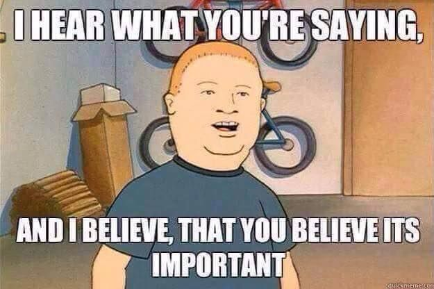

# Which algorithms should I use?

Personal note of programming algorithms and data structures.

-   **Two pointers** [:material-information-variant:][cycle-detection]

    ---

    [:material-set-center:{ .xxxl }](two-pointers.md)

    Left and right pointers, sliding window and fast-slow pointers.

    [:material-arrow-right: Problem characteristics](two-pointers.md#problem-characteristics)

-   **Recursion** [:material-information-variant:][recursion]

    ---

    [:material-file-tree-outline:{ .xxxl }](recursion.md)

    Recursion, backtracking and divide-and-conquer.

    :material-arrow-right: Problem characteristics

-   **Dynamic programming** [:material-information-variant:][dynamic-programming]

    ---

    [:material-database:{ .xxxl }](dynamic-programming.md)

    Dynamic programming, memoization and tabulation.

    :material-arrow-right: Problem characteristics

-   **Greedy** [:material-information-variant:][greedy]

    ---

    [:material-sitemap-outline:{ .xxxl }](greedy.md)

    The greedy algorithm.

    :material-arrow-right: Problem characteristics

[cycle-detection]: https://en.wikipedia.org/wiki/Cycle_detection "Wikipedia: Cycle detection"
[dynamic-programming]: https://en.wikipedia.org/wiki/Dynamic_programming "Wikipedia: Dynamic programming"
[recursion]: https://en.wikipedia.org/wiki/Recursion "Wikipedia: Recursion"
[greedy]: https://en.wikipedia.org/wiki/Greedy_algorithm "Wikipedia: Greedy algorithm"
