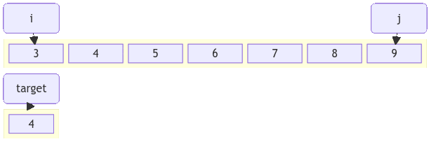

!!! quote inline end
    &ldquo;Perfection is achieved, not when there is nothing more to add, but
    when there is nothing left to take away.&rdquo;
    &mdash; *Antoine de Saint Exupéry*

Case | Time complexity | Space complexity
--- | :---: | :---:
Best | $\color{white} \fcolorbox{limegreen}{forestgreen} {Ω(1)}$
Average | $\color{black} \fcolorbox{yellowgreen}{greenyellow} {Θ(log(n))}$
Worst | $\color{black} \fcolorbox{yellowgreen}{greenyellow} {O(log(n))}$ | $\color{white} \fcolorbox{limegreen}{forestgreen} {O(1)}$

Binary search or logarithmic search, finds the center position to divide the
array into two halves.

<div class="grid" markdown>
=== "Groovy"
    ```groovy
    int binarySearch(int[] array, int target, int start, int end) {
        while (start <= end) {
            var center = start + (end - start) / 2
            if (target == array[center]) {
                return center
            }
            if (target > array[center]) {
                start = center + 1
            } else {
                end = center - 1
            }
        }
        return -1
    }
    ```
=== "Java"
    ```java
    int binarySearch(int array[], int target, int start, int end) {
        while (start <= end) {
            int center = start + (end - start) / 2;
            if (target == array[center]) {
                return center;
            }
            if (target > array[center]) {
                start = center + 1;
            } else {
                end = center - 1;
            }
        }
        return -1;
    }
    ```
=== "Kotlin"
    ```kotlin
    fun binarySearch(array: IntArray, target: Int, start: Int, end: Int): Int {
        while (start <= end) {
            val center = start + (end - start) / 2
            if (target == array[center]) {
                return center
            }
            if (target > array[center]) {
                start = center + 1
            } else {
                end = center - 1
            }
        }
        return -1
    }
    ```
=== "JavaScript"
    ```javascript
    function binarySearch(array, target, start, end) {
        while (start <= end) {
            const center = start + Math.floor((end - start) / 2);
            if (target === array[center]) {
                return center;
            }
            if (target > array[center]) {
                start = center + 1;
            } else {
                end = center - 1;
            }
        }
        return -1;
    }
    ```
=== "Python"
    ```python
    def binary_search(array, target, start, end):
        while start <= end:
            center = start + (end - start) // 2
            if target == array[center]:
                return center
            if target > array[center]:
                start = center + 1
            else:
                end = center - 1
        return -1
    ```
=== "TypeScript"
    ```typescript
    function binarySearch(array: number[], target: number, start: number, end: number): number {
        while (start <= end) {
            const center = start + Math.floor((end - start) / 2);
            if (target === array[center]) {
                return center;
            }
            if (target > array[center]) {
                start = center + 1;
            } else {
                end = center - 1;
            }
        }
        return -1;
    }
    ```


</div>

## Use cases

<div class="grid cards" markdown>
- :material-sort:{ .lg .middle } The list is sorted.
</div>
