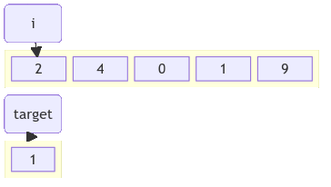

!!! quote inline end
    &ldquo;When in doubt, use brute force.&rdquo;
    &mdash; *Ken Thompson*

Case | Time complexity | Space complexity
--- | :---: | :---:
Best | $\color{white} \fcolorbox{limegreen}{forestgreen} {Ω(1)}$
Average | $\color{black} \fcolorbox{gold}{yellow} {Θ(n)}$
Worst | $\color{black} \fcolorbox{gold}{yellow} {O(n)}$ | $\color{white} \fcolorbox{limegreen}{forestgreen} {O(1)}$

Linear search or sequential search, iterates through each element until item is
found.

<div class="grid" markdown>
=== "Groovy"
    ```groovy
    int linearSearch(int[] array, int target) {
        for (var i = 0; i < array.length; i++) {
            if (array[i] == target) {
                return i
            }
        }
        return -1
    }
    ```
=== "Java"
    ```java
    int linearSearch(int array[], int target) {
        for (int i = 0; i < array.length; i++) {
            if (array[i] == target) {
                return i;
            }
        }
        return -1;
    }
    ```
=== "Kotlin"
    ```kotlin
    fun linearSearch(array: IntArray, target: Int): Int {
        for (i in array.indices) {
            if (array[i] == target) {
                return i
            }
        }
        return -1
    }
    ```
=== "JavaScript"
    ```javascript
    function linearSearch(array, target) {
      for (let i = 0; i < array.length; i++) {
        if (array[i] === target) {
          return i;
        }
      }
      return -1;
    }
    ```
=== "Python"
    ```python
    def linear_search(array: list[int], target: int) -> int:
        for i in range(len(array)):
            if array[i] == target:
                return i
        return -1
    ```
=== "TypeScript"
    ```typescript
    function linearSearch(array: number[], target: number): number {
      for (let i = 0; i < array.length; i++) {
        if (array[i] === target) {
          return i;
        }
      }
      return -1;
    }
    ```


</div>

## Use cases

<div class="grid cards" markdown>
- :material-size-s:{ .lg .middle } The list to search is small
</div>
