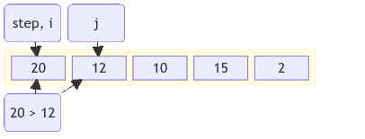

!!! quote inline end
    &ldquo;It's **hardware** that makes a machine fast. It's **software** that
    makes a fast machine slow.&rdquo;
    &mdash; *Craig Bruce*

Case | Time complexity | Space complexity
--- | :---: | :---:
Best | $\color{white} \fcolorbox{crimson}{firebrick} {Ω(n^2)}$
Average | $\color{white} \fcolorbox{crimson}{firebrick} {Θ(n^2)}$
Worst | $\color{white} \fcolorbox{crimson}{firebrick} {O(n^2)}$ | $\color{white} \fcolorbox{limegreen}{forestgreen} {O(1)}$

Selection sort is easy to implement but performs the worst of them all.

<div class="grid" markdown>
=== "Groovy"
    ```groovy
    def selectionSort(int[] array) {
        for (var step = 0; step < array.length - 1; step++) {
            int minIndex = step
            for (var i = step + 1; i < array.length; i++) {
                if (array[i] < array[minIndex]) {
                    minIndex = i
                }
            }
            int temp = array[step]
            array[step] = array[minIndex]
            array[minIndex] = temp
        }
    }
    ```
=== "Java"
    ```java
    void selectionSort(int array[]) {
        for (int step = 0; step < array.length - 1; step++) {
            int minIndex = step;
            for (int i = step + 1; i < array.length; i++) {
                if (array[i] < array[minIndex]) {
                    minIndex = i;
                }
            }
            int temp = array[step];
            array[step] = array[minIndex];
            array[minIndex] = temp;
        }
    }
    ```
=== "JavaScript"
    ```javascript
    function selectionSort(array) {
      for (let step = 0; step < array.length - 1; step++) {
        let minIndex = step;
        for (let i = step + 1; i < array.length; i++) {
          if (array[i] < array[minIndex]) {
            minIndex = i;
          }
        }
        let temp = array[step];
        array[step] = array[minIndex];
        array[minIndex] = temp;
      }
    }
    ```
=== "Kotlin"
    ```kotlin
    fun selectionSort(array: IntArray) {
        for (step in 0 until array.lastIndex) {
            var minIndex = step
            for (i in step + 1 until array.size) {
                if (array[i] < array[minIndex]) {
                    minIndex = i
                }
            }
            val temp = array[step]
            array[step] = array[minIndex]
            array[minIndex] = temp
        }
    }
    ```
=== "Python"
    ```python
    def selection_sort(array):
        for step in range(len(array) - 1):
            min_index = step
            for i in range(step + 1, len(array)):
                if array[i] < array[min_index]:
                    min_index = i
            array[step], array[min_index] = array[min_index], array[step]
    ```
=== "TypeScript"
    ```typescript
    function selectionSort(array: number[]): void {
      for (let step = 0; step < array.length - 1; step++) {
        let minIndex = step;
        for (let i = step + 1; i < array.length; i++) {
          if (array[i] < array[minIndex]) {
            minIndex = i;
          }
        }
        let temp = array[step];
        array[step] = array[minIndex];
        array[minIndex] = temp;
      }
    }
    ```


</div>

## Use cases

<div class="grid cards" markdown>
- :material-size-s:{ .lg .middle } The list to sort is small
- :material-magnify:{ .lg .middle } It needs to check all elements
- :material-swap-horizontal:{ .lg .middle } Swapping elements is okay
</div>
