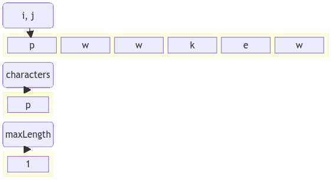

!!! quote inline end
    &ldquo;Algorithmic complexity for structured programmers: **All algorithms
    are $\boldsymbol{O(f(n))}$, where $\boldsymbol{f}$ is someone else's
    responsibility.**&rdquo;
    &mdash; *Peter Cooper*

Make use of two pointers to solve problems that require traversing a sequence of elements.

Common problems:

- [Two Sum](https://hanggrian.github.io/grind-leetcode/two-sum)
- [Container With Most Water](https://hanggrian.github.io/grind-leetcode/container-with-most-water)
- [Trapping Rain Water](https://hanggrian.github.io/grind-leetcode/trapping-rain-water)

<div class="grid" markdown>
=== "Groovy"
    ```groovy
    int[] twoSum(int[] nums, int target) {
        for (var i = 0; i < nums.length; i++) {
            for (var j = i + 1; j < nums.length; j++) {
                if (nums[j] == target - nums[i]) {
                    return new int[]{i, j}
                }
            }
        }
        return []
    }
    ```
=== "Java"
    ```java
    int[] twoSum(int[] nums, int target) {
        for (int i = 0; i < nums.length; i++) {
            for (int j = i + 1; j < nums.length; j++) {
                if (nums[j] == target - nums[i]) {
                    return new int[]{i, j};
                }
            }
        }
        return null;
    }
    ```
=== "JavaScript"
    ```javascript
    function twoSum(nums, target) {
      for (let i = 0; i < nums.length; i++) {
        const complement = target - nums[i];
        if (nums.slice(i + 1).includes(complement)) {
          return [i, nums.indexOf(complement, i + 1)];
        }
      }
      return undefined;
    }
    ```
=== "Kotlin"
    ```kotlin
    fun twoSum(nums: IntArray, target: Int): IntArray {
        for (i in nums.indices) {
            for (j in i + 1 until nums.size) {
                if (nums[j] == target - nums[i]) {
                    return intArrayOf(i, j)
                }
            }
        }
        return intArrayOf()
    }
    ```
=== "Python"
    ```python
    def two_sum(self, nums: list[int], target: int) -> list[int] | None:
        for i, num in enumerate(nums):
            complement = target - num
            if complement in nums[i + 1:]:
                return [i, nums.index(complement, i + 1)]
        return None
    ```
=== "TypeScript"
    ```typescript
    function twoSum(nums: number[], target: number): number[] {
      for (let i = 0; i < nums.length; i++) {
        const complement = target - nums[i];
        if (nums.slice(i + 1).includes(complement)) {
          return [i, nums.indexOf(complement, i + 1)];
        }
      }
      return undefined;
    }
    ```


</div>

## Sliding window

Restrict the range of the two pointers to a certain window size or condition.

Common problems:

- [Longest Substring Without Repeating Characters](https://hanggrian.github.io/grind-leetcode/longest-substring-without-repeating-characters)
- [Minimum Window Substring](https://hanggrian.github.io/grind-leetcode/minimum-window-substring)
- Sliding Window Maximum

<div class="grid" markdown>
=== "Groovy"
    ```groovy
    int lengthOfLongestSubstring(String s) {
        HashSet<Character> characters = []
        var start = 0
        var end = 0
        var maxLength = Integer.MIN_VALUE
        while (end < s.length()) {
            if (characters.add(s.charAt(end))) {
                maxLength = Math.max(maxLength, characters.size())
                end++
                continue
            }
            characters.remove(s.charAt(start))
            start++
        }
        return maxLength
    }
    ```
=== "Java"
    ```java
    int lengthOfLongestSubstring(String s) {
        Set<Character> characters = new HashSet<>();
        int start = 0;
        int end = 0;
        int maxLength = Integer.MIN_VALUE;
        while (end < s.length()) {
            if (characters.add(s.charAt(end))) {
                maxLength = Math.max(maxLength, characters.size());
                end++;
                continue;
            }
            characters.remove(s.charAt(start));
            start++;
        }
        return maxLength;
    }
    ```
=== "JavaScript"
    ```javascript
    function lengthOfLongestSubstring(s) {
        const characters = new Set();
        let start = 0;
        let end = 0;
        let maxLength = Number.MIN_SAFE_INTEGER;
        while (end < s.length) {
          if (!characters.has(s[end])) {
            characters.add(s[end]);
            end++;
            maxLength = Math.max(maxLength, characters.size);
            continue;
          }
          characters.delete(s[start]);
          start++;
        }
        return maxLength;
      }
    ```
=== "Kotlin"
    ```kotlin
    fun lengthOfLongestSubstring(s: String): Int {
        val characters = hashSetOf<Char>()
        var start = 0
        var end = 0
        var maxLength = Int.MIN_VALUE
        while (end < s.length) {
            if (characters.add(s[end])) {
                maxLength = max(maxLength, characters.size)
                end++
                continue
            }
            characters -= s[start]
            start++
        }
        return maxLength
    }
    ```
=== "Python"
    ```python
    def length_of_longest_substring(self, s: str) -> int:
        characters = set()
        start = 0
        end = 0
        max_length = -maxsize
        while end < len(s):
            if s[end] not in characters:
                characters.add(s[end])
                end += 1
                max_length = max(max_length, len(characters))
                continue
            characters.remove(s[start])
            start += 1
    ```
=== "TypeScript"
    ```typescript
    function lengthOfLongestSubstring(s: string): number {
        const characters = new Set<string>();
        let start = 0;
        let end = 0;
        let maxLength = Number.MIN_SAFE_INTEGER;
        while (end < s.length) {
          if (!characters.has(s[end])) {
            characters.add(s[end]);
            end++;
            maxLength = Math.max(maxLength, characters.size);
            continue;
          }
          characters.delete(s[start]);
          start++;
        }
        return maxLength;
      }
    ```


</div>

## Fast-slow pointers

Pointers that move at different speeds to find a cycle or a specific condition.

Common problems:

- [Linked List Cycle](https://hanggrian.github.io/grind-leetcode/linked-list-cycle)
- [Sort List](https://hanggrian.github.io/grind-leetcode/sort-list)
- [Reorder List](https://hanggrian.github.io/grind-leetcode/reorder-list)

<div class="grid" markdown>
=== "Groovy"
    ```groovy
    boolean hasCycle(SinglyListNode head) {
        var slow = head.next
        var fast = head.next.next
        while (fast != null && fast.hasNext() && slow != fast) {
            slow = slow.next
            fast = fast.next.next
        }
        return slow == fast
    }
    ```
=== "Java"
    ```java
    boolean hasCycle(ListNode head) {
        SinglyListNode slow = head.next;
        SinglyListNode fast = head.next.next;
        while (fast != null && fast.hasNext() && slow != fast) {
            slow = slow.next;
            fast = fast.next.next;
        }
        return slow == fast;
    }
    ```
=== "JavaScript"
    ```javascript
    function hasCycle(head) {
      let slow = head.next;
      let fast = head.next.next;
      while (fast && fast.hasNext() && slow !== fast) {
        slow = slow.next;
        fast = fast.next.next;
      }
      return slow === fast;
    }
    ```
=== "Kotlin"
    ```kotlin
    fun hasCycle(head: SinglyListNode?): Boolean {
        if (head?.next == null) {
            return false
        }
        var slow = head.next
        var fast = head.next!!.next
        while (fast != null && fast.hasNext() && slow !== fast) {
            slow = slow!!.next
            fast = fast.next!!.next
        }
        return slow === fast
    }
    ```
=== "Python"
    ```python
    def has_cycle(self, head: ListNode) -> bool:
        slow = head.next
        fast = head.next.next
        while fast and fast.next and slow != fast:
            slow = slow.next
            fast = fast.next.next
        return slow == fast
    ```
=== "TypeScript"
    ```typescript
    function hasCycle(head: SinglyListNode | undefined): boolean {
      let slow = head.next;
      let fast = head.next.next;
      while (fast && fast.hasNext() && slow !== fast) {
        slow = slow.next;
        fast = fast.next.next;
      }
      return slow === fast;
    }
    ```


</div>

## Problem characteristics

<div class="grid cards" markdown>
- :material-minus:{ .lg .middle } The data structure is linear
- :material-pan-horizontal:{ .lg .middle } The task is to find more than one element
</div>
